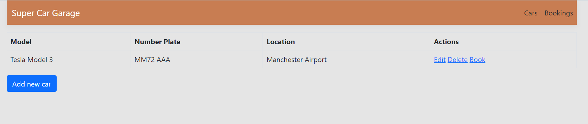
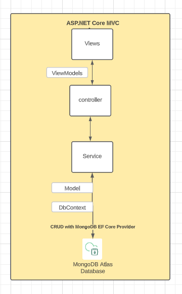
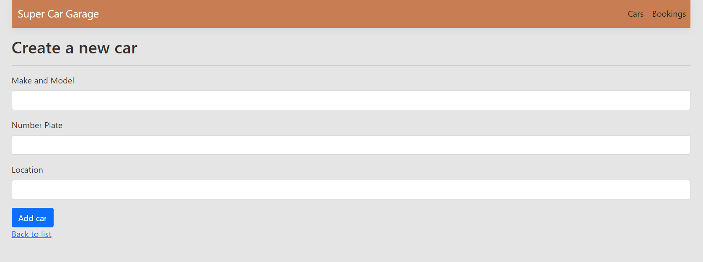
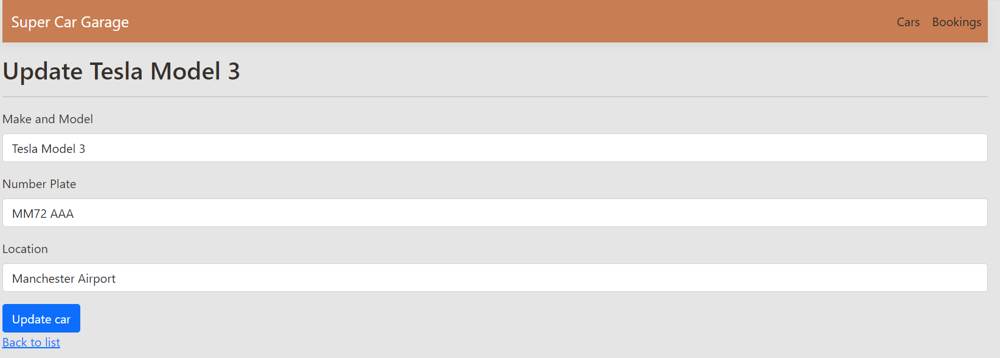
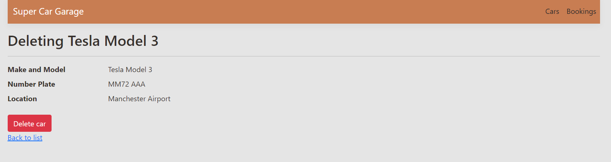
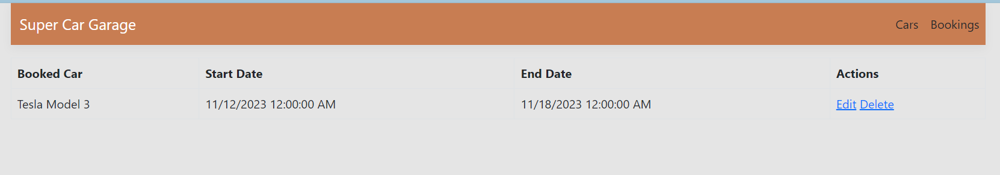
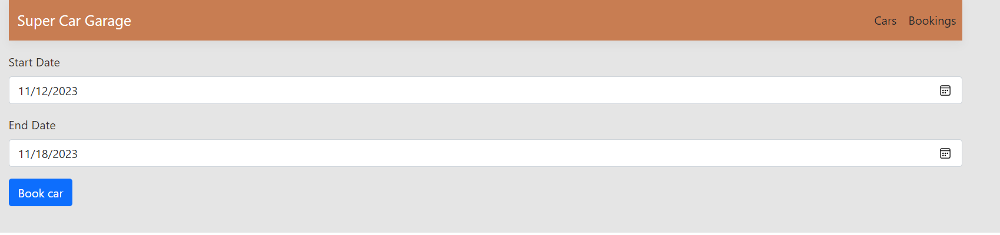

# SuperCarGarage
A sample application using ASP.NET MVC that shows CRUD with change tracking using the new MongoDB EF Core Provider.

The app is a simple car garage and booking system that allows you to add, edit and delete cars and bookings.

## Prerequisites
* [.NET 7.0](https://dotnet.microsoft.com/en-us/download/dotnet/7.0)
* [MongoDB Atlas Account](https://mdb.link/atlas)
* [Free M0 Tier Cluster](https://mdb.link/deploy-free-cluster)

## Running the application
In order to run the application, add your [Atlas Connection String](https://mdb.link/efcore-connectionstring) to your appsettings.json and appsettings.Development.json files.

```
dotnet run
```

Once you visit the URL shown in your CLI, you will see something similar to below.



## Usage
There are two main endpoints you can visit:
/Car and /Booking.

Both will list the existing cars and bookings in the database. In the case of the cars, if the car is not already booked, you will see a book button in the Actions column.

## Getting to know the code




The above diagram gives a rough overview of the architecture of the app.

If you have written ASP.NET MVC apps before, this will be nothing new.

### Views
The views are written using Razor pages. There are views for cars, adding cars, editing cars and deleting cars with each taking either a model or a viewmodel.

The same also exists for bookings.

### Controllers
There are two controllers; CarController and BookingController.

Both provide the endpoints for the CRUD operations as mentioned above.

It uses the common naming convention so the view names match the method names in the controllers.

### Services
Both cars and bookings have an interface and associated implementation.

They are what the controllers talk to and then the service classes are what talk to the database via the CarBookingDbContext class.

## Example Screenshots


Adding a new car


Editing an existing car


Deleting a car


List of bookings


